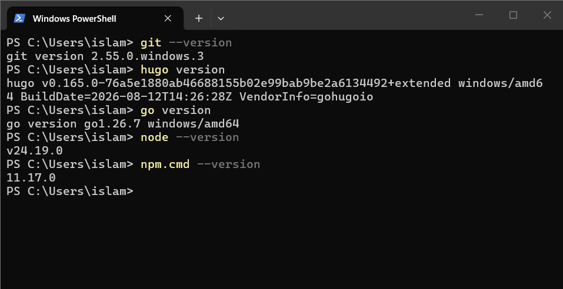
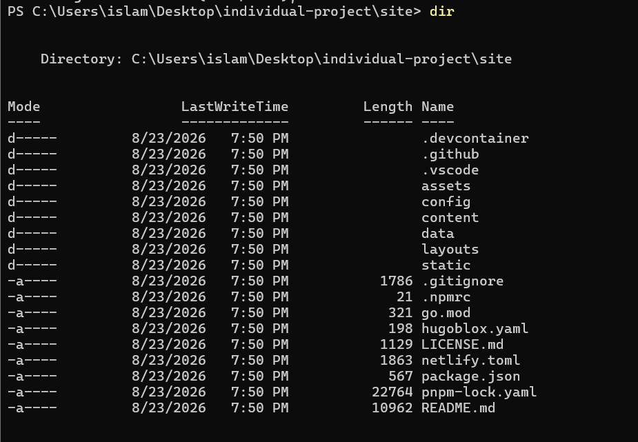
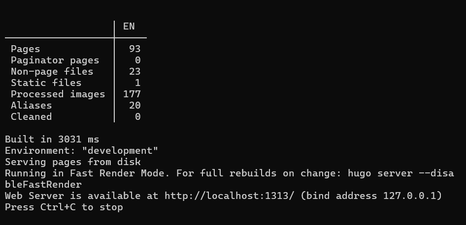
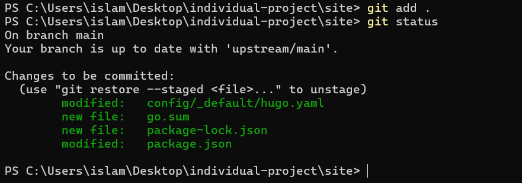
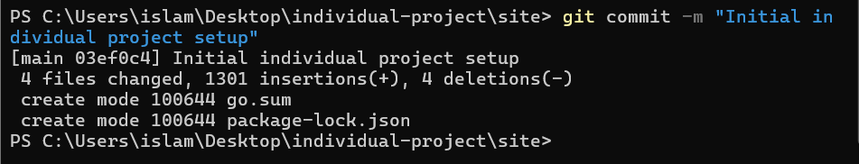
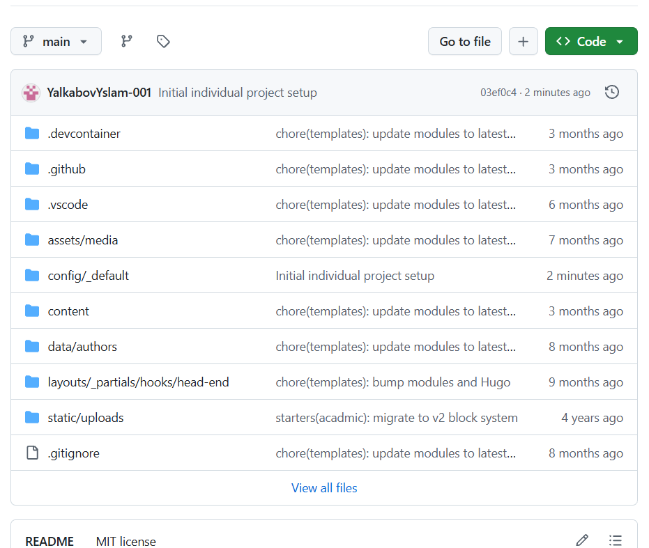
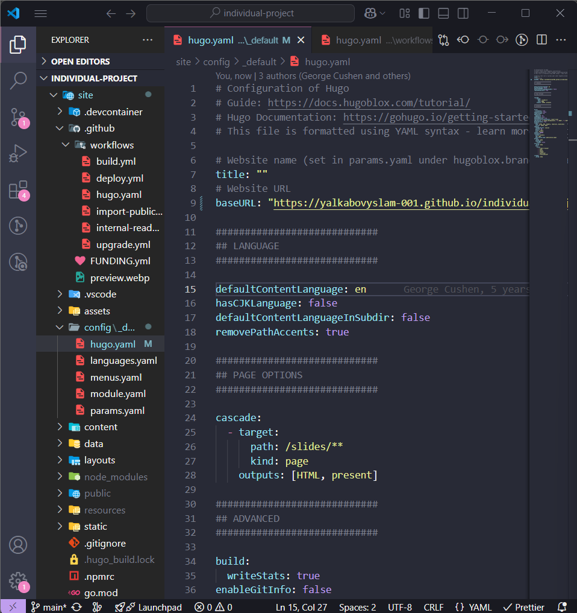
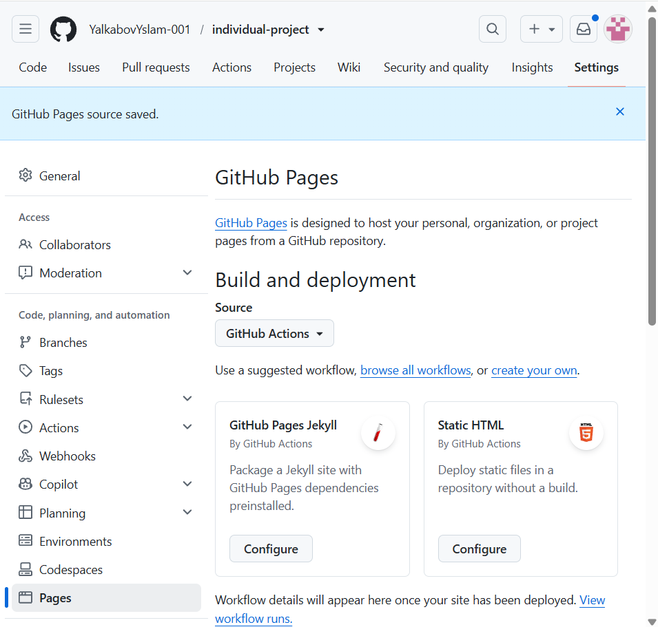

---

marp: true
theme: default
paginate: true
header: "Индивидуальный проект"
footer: "Ялкабов Ислам | НКАбд-06-25"
-------------------------------------

# Индивидуальный проект

## Этап 1

### Размещение заготовки персонального сайта на GitHub Pages

**Выполнил:** Ялкабов Ислам
**Группа:** НКАбд-06-25

---

# Цель этапа

Создать базовую версию персонального сайта и разместить её в сети с использованием **GitHub Pages**.

### Основные задачи

* установить необходимое ПО;
* скачать шаблон сайта;
* подготовить проект Hugo;
* разместить проект на GitHub;
* настроить URL;
* опубликовать сайт через GitHub Pages;
* проверить работу сайта.

---

# Используемые технологии

В работе использовались:

* **Hugo** — генератор статических сайтов;
* **Git** — система контроля версий;
* **GitHub** — хранение проекта;
* **GitHub Pages** — публикация сайта;
* **Visual Studio Code** — редактирование проекта;
* **PowerShell** — работа с командной строкой.

---

# Подготовка окружения

Было установлено необходимое программное обеспечение.

Для проверки Git использовалась команда:

```powershell
git --version
```

Для проверки Hugo:

```powershell
hugo version
```

---

# Проверка Git и Hugo

Результаты выполнения команд показали, что необходимые инструменты установлены и готовы к работе.

---



---

# Получение шаблона сайта

В качестве основы был использован готовый шаблон персонального сайта.

Шаблон содержит:

* структуру Hugo-проекта;
* конфигурационные файлы;
* страницы;
* шаблоны;
* стили;
* структуру публикаций;
* настройки автора.

---

# Структура проекта

Основные каталоги проекта:

```text
site/
├── assets/
├── config/
├── content/
├── layouts/
├── static/
├── themes/
├── package.json
└── hugo.yaml
```



---

# Локальный запуск сайта

Перед публикацией сайт был проверен локально.

Использовалась команда:

```powershell
hugo server --disableFastRender
```

Локальный сайт открывался в браузере по адресу:

```text
http://localhost:1313/
```
---


---


# Проверка сайта локально

Локальный запуск позволяет проверить:

* отображение страниц;
* работу навигации;
* загрузку стилей;
* структуру сайта;
* отсутствие критических ошибок.
---


---

# Создание Git-репозитория

Для хранения исходного кода проекта был создан репозиторий GitHub.

Состояние проекта проверялось командой:

```powershell
git status
```

После этого файлы были добавлены в Git:

```powershell
git add .
```
---


---

# Первый commit

Первоначальная версия проекта была сохранена в истории Git.

Использовалась команда:

```powershell
git commit -m "Initial website setup"
```

После создания commit изменения были отправлены на GitHub:

```powershell
git push
```
---


---

# Репозиторий GitHub

После выполнения `git push` файлы проекта появились в удалённом репозитории.

Репозиторий содержит исходный код и конфигурационные файлы персонального сайта.

---



---

# Настройка URL

Для корректного формирования ссылок Hugo был настроен параметр:

```yaml
baseURL: "https://YalkabovYslam-001.github.io/..."
```

Параметр `baseURL` используется для формирования правильных адресов:

* страниц;
* изображений;
* CSS;
* JavaScript;
* других ресурсов.

---


---
# Сборка сайта

После настройки проекта была выполнена сборка Hugo:

```powershell
hugo
```

При успешной сборке Hugo генерирует статические файлы сайта.

---

# GitHub Pages

Для публикации сайта использовался сервис **GitHub Pages**.

В настройках репозитория был открыт раздел:

```text
Settings → Pages
```

После настройки источника публикации GitHub Pages автоматически размещает подготовленный сайт.

---


---
# Результат публикации

После завершения публикации сайт стал доступен через Интернет.

Была выполнена проверка:

* доступности главной страницы;
* правильности URL;
* отображения элементов сайта;
* загрузки стилей;
* работоспособности навигации.

---


---
# Результаты этапа

В результате работы:

✅ установлен необходимый инструментарий;

✅ получен шаблон персонального сайта;

✅ подготовлен проект Hugo;

✅ создан Git-репозиторий;

✅ проект размещён на GitHub;

✅ настроен `baseURL`;

✅ выполнена сборка сайта;

✅ настроен GitHub Pages;

✅ сайт опубликован в Интернете.

---

# Вывод

На первом этапе была создана базовая версия персонального сайта.

Были получены практические навыки работы с:

* Hugo;
* Git;
* GitHub;
* GitHub Pages;
* Visual Studio Code.

Созданная заготовка стала основой для дальнейшего наполнения сайта персональной информацией и публикациями.

---

# Спасибо за внимание!

## Этап 1 выполнен
