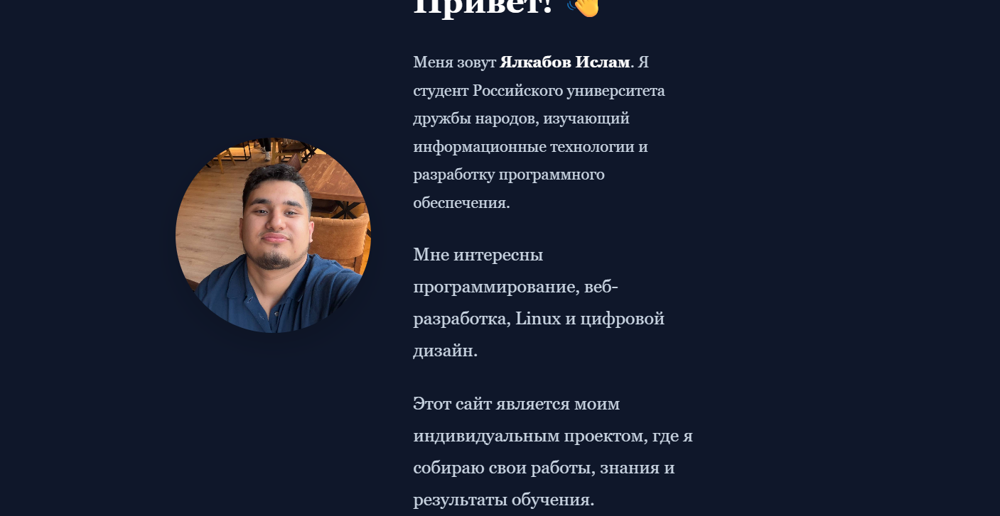
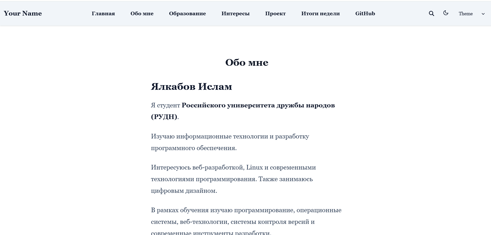
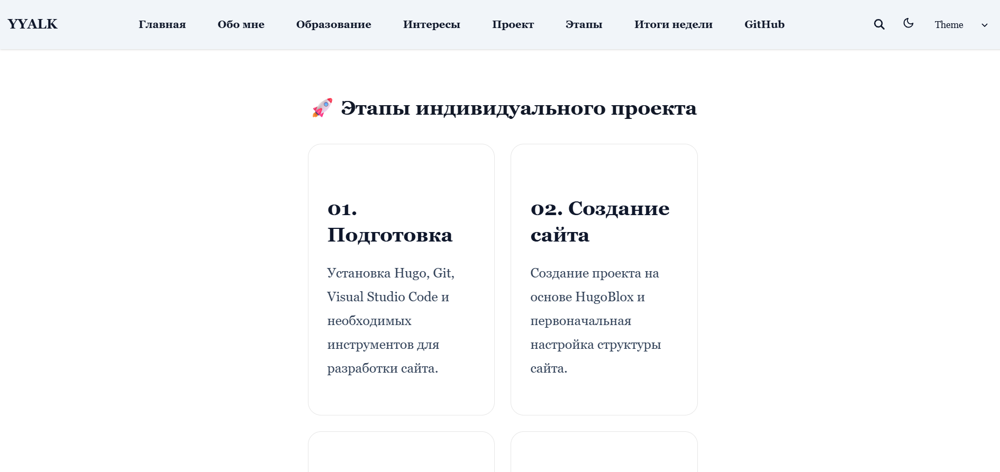
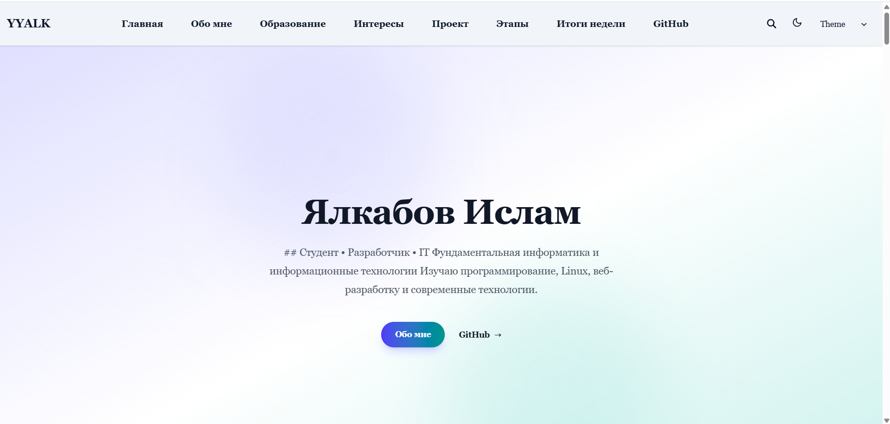
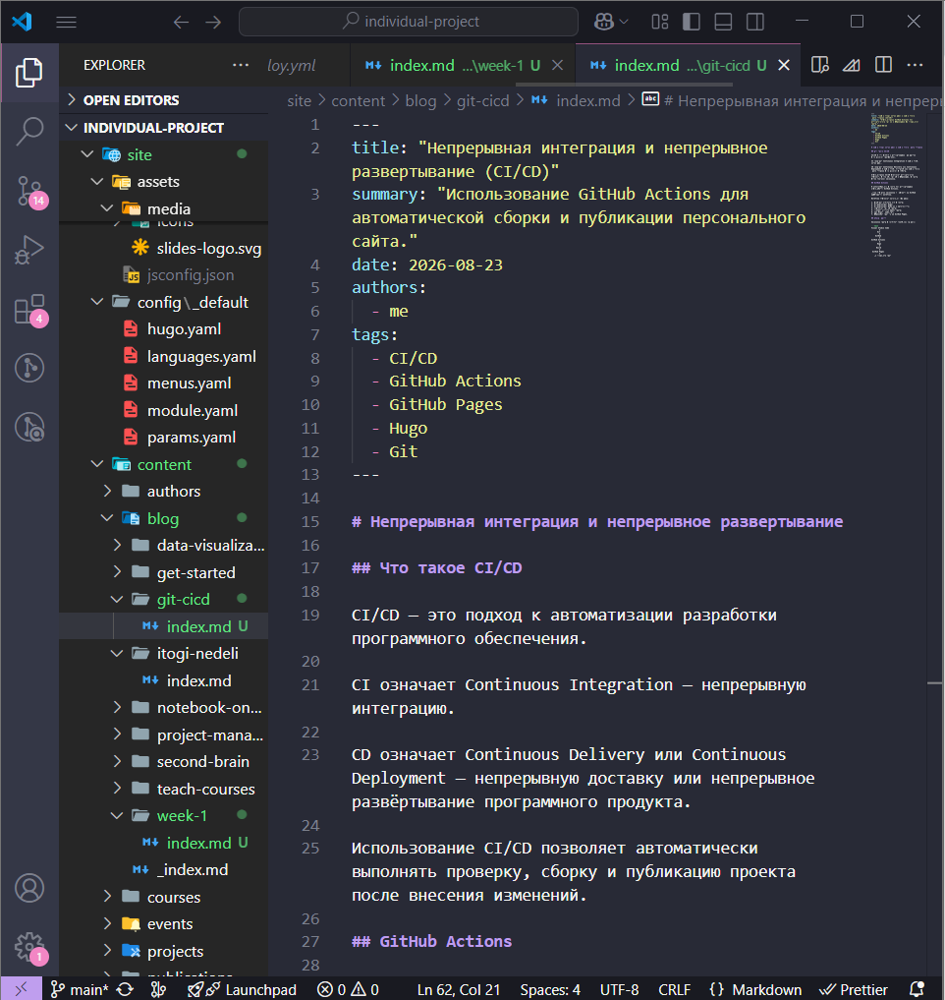
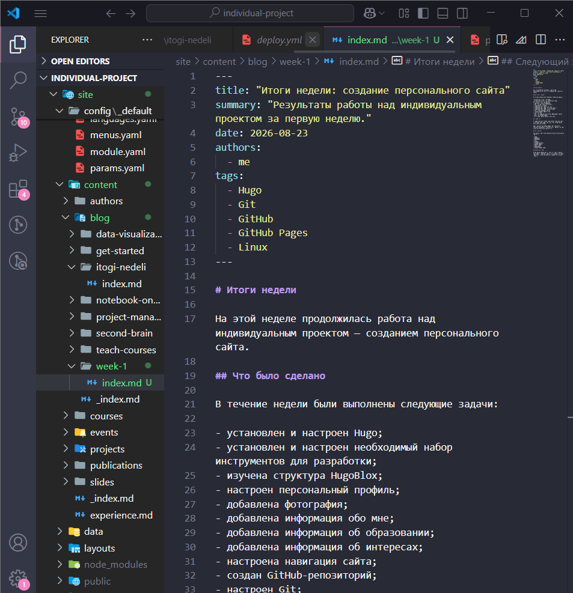

# Индивидуальный проект

## Этап 2

### Добавление персональной информации на персональный сайт

**Студент:** Ялкабов Ислам
**Группа:** НКАбд-06-25

Российский университет дружбы народов
2026

---

# Цель этапа

Добавить на персональный сайт информацию о разработчике и подготовить первые публикации.

### Основные задачи

* добавить фотографию;
* заполнить Biography;
* указать Interests;
* добавить Education;
* создать еженедельный пост;
* создать тематический пост;
* проверить отображение информации на сайте.

---

# Используемые технологии

* **Hugo** — генерация статического сайта;
* **Markdown** — создание страниц и публикаций;
* **YAML** — настройка конфигурации;
* **Git** — контроль версий;
* **GitHub** — хранение проекта;
* **GitHub Pages** — публикация сайта;
* **Visual Studio Code** — редактирование файлов.

---

# Персональная информация

На сайте была создана структура с основными сведениями:

* фотография;
* краткая биография;
* интересы;
* образование;
* публикации;
* тематические материалы.

Информация размещается непосредственно в контенте Hugo.

---

# Добавление фотографии

На страницу профиля была добавлена фотография.

Фотография используется как основной визуальный элемент профиля и позволяет идентифицировать автора сайта.

---


---

# Biography

В разделе **Biography** размещена краткая информация об авторе:

> Студент, изучающий информационные технологии и разработку программного обеспечения.

Также указаны интересы в области:

* веб-разработки;
* Linux;
* современных технологий программирования;
* цифрового дизайна.

---


---

# Interests

В разделе **Interests** указаны основные направления:

* Linux;
* C++;
* Python;
* Web development;
* Digital design.

Это позволяет показать направления обучения и профессиональные интересы автора.

---


---

# Education

В разделе **Education** указано образование:

**Российский университет дружбы народов**

Направление:

**«Фундаментальная информатика и информационные технологии»**

Группа:

**НКАбд-06-25**

---


---

# Проверка локального сайта

После внесения изменений сайт был запущен локально.

```powershell
hugo server --disableFastRender
```

После запуска сайт доступен по адресу:

```text
http://localhost:1313/
```

Локальный просмотр позволяет проверить изменения до публикации.

---


---

# Еженедельный пост

Была создана еженедельная публикация о выполненной работе.

Пример расположения файла:

```text
content/
└── blog/
    └── week-2/
        └── index.md
```

В публикации описаны:

* выполненные задачи;
* изменения сайта;
* использованные технологии;
* полученный результат.

---

# Публикация на сайте

После создания Markdown-файла Hugo автоматически формирует страницу публикации.

Проверено:

* наличие поста в списке публикаций;
* правильность заголовка;
* отображение текста;
* корректность даты;
* работа ссылки на страницу.

---


---

# Тематический материал

В рамках второго этапа был выбран тематический материал:

## «Управление версиями. Git»

В статье рассмотрены основные возможности Git:

* создание репозитория;
* отслеживание изменений;
* создание коммитов;
* работа с ветками;
* синхронизация с удалённым репозиторием.

---


---

# Основные команды Git

Для работы с проектом использовались основные команды:

```bash
git init
git status
git add .
git commit -m "message"
git push
git pull
```

Git позволяет сохранять историю изменений проекта и возвращаться к предыдущим версиям файлов.

---

# Git и GitHub

### Git

Система контроля версий, которая работает локально.

### GitHub

Удалённая платформа для хранения Git-репозиториев и совместной работы.

Схема работы:

```text
Изменение файлов
       ↓
    git add
       ↓
   git commit
       ↓
    git push
       ↓
     GitHub
```

---

# Сохранение изменений

После завершения работы изменения были добавлены в Git:

```bash
git status
git add .
git commit -m "Add personal information and posts"
git push
```

Таким образом, обновлённая версия проекта была отправлена в удалённый репозиторий.


---

# Итоговый вид сайта

После выполнения второго этапа сайт содержит:

* фотографию автора;
* Biography;
* Interests;
* Education;
* еженедельную публикацию;
* тематическую статью о Git;
* обновлённую информацию в репозитории.


---

# Результаты этапа

В результате второго этапа:

* добавлена персональная информация;
* оформлен профиль автора;
* добавлена фотография;
* указаны интересы и образование;
* создан еженедельный пост;
* создан тематический материал о Git;
* изменения сохранены в Git;
* сайт проверен локально и опубликован.

---

# Вывод

В ходе второго этапа персональный сайт был дополнен основной информацией об авторе.

Также были созданы первые публикации и освоена работа с контентом Hugo в формате Markdown.

Все изменения сохранены с использованием Git и подготовлены для дальнейшего развития сайта.

---

# Спасибо за внимание!

## Этап 2 выполнен

**Ялкабов Ислам**
**НКАбд-06-25**

