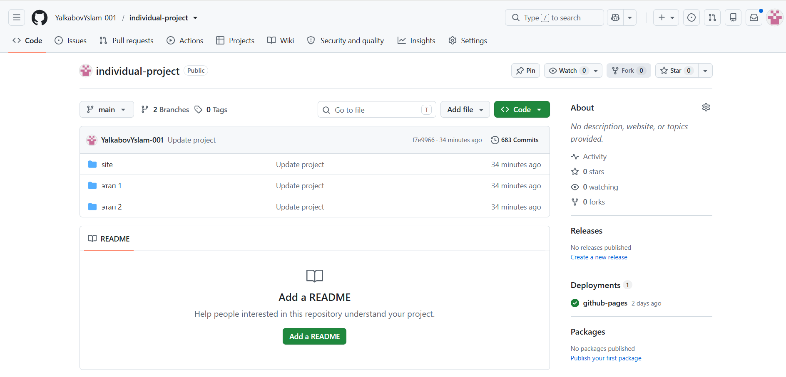

---

title: "ОТЧЁТ ПО ИНДИВИДУАЛЬНОМУ ПРОЕКТУ"
subtitle: "Этап 2. Добавление персональной информации на сайт"
author: "Ялкабов Ислам"
date: "2026"
------------

# Российский университет дружбы народов

## Образовательная программа

**Фундаментальная информатика и информационные технологии**

### ОТЧЁТ

### ПО ИНДИВИДУАЛЬНОМУ ПРОЕКТУ

**Этап 2**

**Тема:**
**Добавление персональной информации на персональный сайт**

Выполнил:
**студент группы НКАбд-05-25**
**Ялкабов Ислам**

Москва
2026

---

# 1. Цель работы

Целью второго этапа индивидуального проекта является наполнение персонального сайта информацией о владельце сайта.

В рамках данного этапа необходимо:

* разместить фотографию владельца сайта;
* добавить краткую биографическую информацию;
* указать интересы;
* добавить сведения об образовании;
* создать публикацию по прошедшей неделе;
* создать тематическую публикацию.

В качестве тематической публикации была выбрана тема **«Управление версиями. Git»**.

---

# 2. Используемые технологии

Для выполнения второго этапа использовались:

| Технология         | Назначение                                |
| ------------------ | ----------------------------------------- |
| Hugo               | Генерация персонального сайта             |
| Markdown           | Создание содержимого страниц и публикаций |
| YAML               | Настройка конфигурации сайта              |
| Git                | Управление версиями                       |
| GitHub             | Хранение исходного кода                   |
| GitHub Pages       | Публикация сайта                          |
| Visual Studio Code | Редактирование файлов проекта             |

---

# 3. Структура персональной информации

На втором этапе сайт был дополнен персональными сведениями.

Основные разделы:

* **Biography** — краткая информация о владельце;
* **Interests** — интересы;
* **Education** — образование;
* фотография владельца сайта;
* публикации.

---

# 4. Добавление фотографии

Первым шагом было добавление фотографии владельца сайта.

Изображение было размещено в структуре проекта Hugo и подключено к профилю автора.

Фотография используется на странице персонального профиля и позволяет визуально идентифицировать владельца сайта.

---


---

# 5. Добавление Biography

В раздел **Biography** была добавлена краткая информация о владельце сайта.

В качестве описания использовался следующий текст:

> Студент, изучающий информационные технологии и разработку программного обеспечения. Интересуюсь веб-разработкой, Linux и современными технологиями программирования. Также занимаюсь цифровым дизайном.

Данный раздел предназначен для краткого представления владельца сайта и его профессиональных интересов.

---


---

# 6. Добавление Interests

Следующим шагом была добавлена информация об интересах владельца сайта.

Основные интересы:

* Linux;
* C++;
* Python;
* Web development;
* Digital design.

Раздел позволяет посетителям получить представление о направлениях, которые интересуют владельца сайта.


---

# 7. Добавление информации об образовании

В раздел **Education** была добавлена информация об образовании.

Указана образовательная программа:

**Фундаментальная информатика и информационные технологии**

Также указана принадлежность к учебной группе:


---

# 8. Проверка отображения персональной информации

После добавления всех данных был выполнен локальный запуск сайта.

Использовалась команда:

```powershell
hugo server --disableFastRender
```

После запуска сайта была выполнена проверка отображения:

* фотографии;
* Biography;
* Interests;
* Education;
* навигации;
* оформления страницы.

---

# 9. Создание публикации по прошедшей неделе

В рамках второго этапа была создана публикация, посвящённая результатам работы за прошедшую неделю.

В публикации описывался процесс разработки персонального сайта.

В статье были отражены следующие направления:

* продолжение работы над сайтом;
* настройка Hugo;
* работа со структурой проекта;
* использование Git;
* публикация проекта;
* дальнейшее наполнение персонального сайта.

Для публикации использовался формат Markdown.

Пример структуры файла:

```text
content/
└── blog/
    └── week-2/
        └── index.md
```


---

# 10. Публикация статьи на сайте

После создания Markdown-файла публикация была автоматически обработана Hugo.

После запуска сайта статья стала доступна в разделе публикаций.

Страница содержит:

* название публикации;
* дату;
* текст статьи;
* информацию об авторе;
* элементы навигации.

---

# 11. Создание тематической публикации

В соответствии с заданием необходимо было создать публикацию на одну из предложенных тем.

Была выбрана тема:

# «Управление версиями. Git»

В публикации рассмотрены основные понятия системы контроля версий:

* назначение Git;
* репозитории;
* commit;
* ветки;
* удалённые репозитории;
* GitHub;
* основные команды Git.

---

# 12. Основные команды Git

В тематической статье были рассмотрены основные команды:

```bash
git init
```

Создание нового локального репозитория.

```bash
git status
```

Проверка состояния рабочего каталога.

```bash
git add .
```

Добавление изменений в индекс.

```bash
git commit -m "message"
```

Создание новой точки в истории проекта.

```bash
git push
```

Отправка локальных изменений в удалённый репозиторий.

```bash
git pull
```

Получение изменений из удалённого репозитория.

---

# 13. Git и GitHub

В статье также рассмотрено взаимодействие Git и GitHub.

**Git** отвечает за локальное управление версиями проекта.

**GitHub** предоставляет удалённое хранилище репозитория и дополнительные возможности для совместной работы и публикации проектов.

В рамках индивидуального проекта Git использовался для хранения истории изменений персонального сайта.



---

# 14. Проверка всех изменений

После добавления персональной информации и публикаций была выполнена проверка сайта.

Проверялись:

* корректность фотографии;
* отображение Biography;
* отображение Interests;
* отображение Education;
* наличие публикации за неделю;
* наличие тематической статьи;
* корректность навигации;
* отображение страниц в браузере.

---

# 15. Размещение изменений в Git

После завершения работы изменения были сохранены в Git.

Использовались команды:

```powershell
git status
```

```powershell
git add .
```

```powershell
git commit -m "Add personal information and posts"
```

```powershell
git push
```

Таким образом, новая версия сайта была сохранена в репозитории GitHub.


---

# 16. Обновление сайта на GitHub Pages

После отправки изменений в GitHub была обновлена опубликованная версия сайта.

Была выполнена повторная проверка сайта через браузер.

На опубликованной версии должны отображаться:

* фотография;
* Biography;
* Interests;
* Education;
* публикация по прошедшей неделе;
* тематическая публикация о Git.


---

# 17. Результаты выполнения этапа

В результате выполнения второго этапа на сайт была добавлена персональная информация.

Были выполнены следующие задачи:

1. Добавлена фотография владельца сайта.
2. Создан раздел Biography.
3. Добавлен раздел Interests.
4. Добавлен раздел Education.
5. Создан пост по результатам прошедшей недели.
6. Создан тематический пост об управлении версиями и Git.
7. Выполнена проверка сайта локально.
8. Изменения сохранены в Git.
9. Обновлён опубликованный сайт.

---

# 18. Вывод

В ходе выполнения второго этапа персональный сайт был дополнен информацией о владельце.

Были добавлены основные персональные сведения: фотография, биография, интересы и образование. Кроме того, были созданы две публикации — отчёт по прошедшей неделе и тематическая статья об управлении версиями с использованием Git.

Полученные навыки позволяют продолжить разработку сайта и перейти к следующему этапу, на котором будут добавлены сведения о навыках, опыте и достижениях.

---

# Приложение. Список скриншотов

|  № | Скриншот                             |
| -: | ------------------------------------ |
|  1 | Фотография владельца сайта           |
|  2 | Раздел Biography                     |
|  3 | Раздел Interests                     |
|  4 | Раздел Education                     |
|  5 | Проверка персональной страницы       |
|  6 | Markdown-файл поста за неделю        |
|  7 | Опубликованный пост за неделю        |
|  8 | Тематическая статья о Git            |
|  9 | Итоговый вид сайта                   |
| 10 | Выполнение `git commit` и `git push` |
| 11 | Обновлённый сайт на GitHub Pages     |
