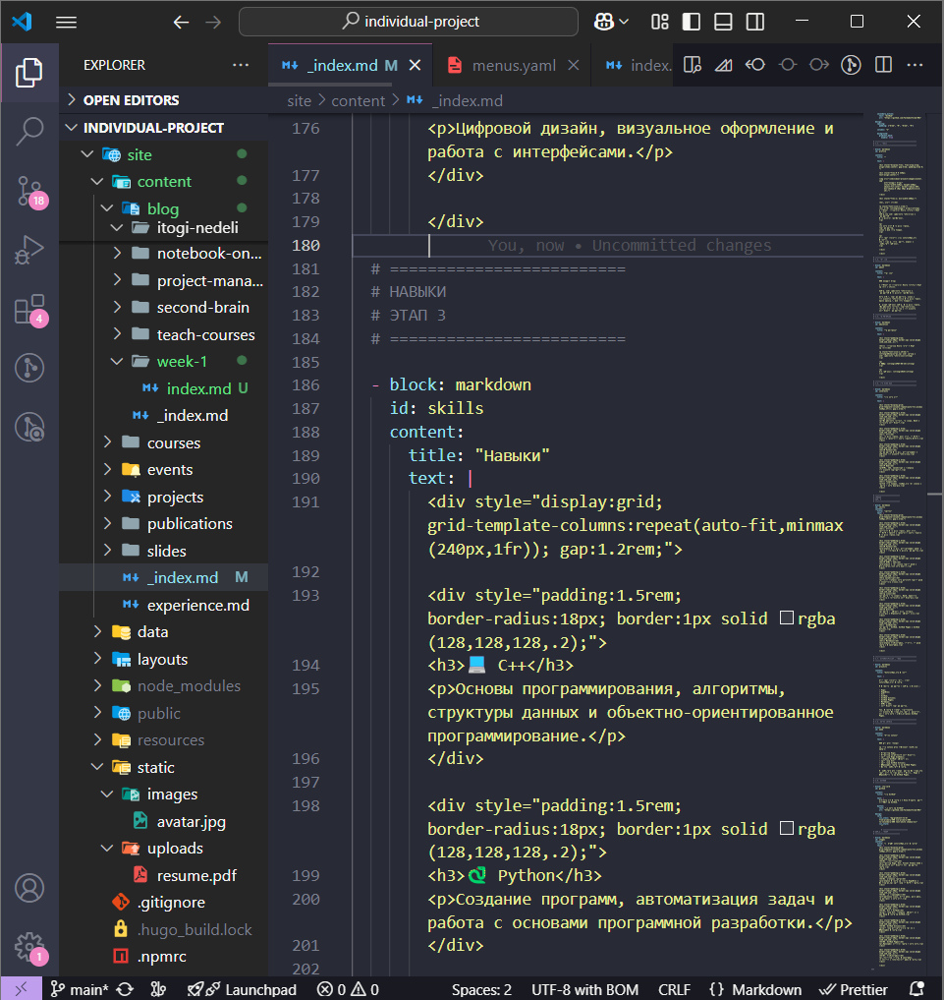
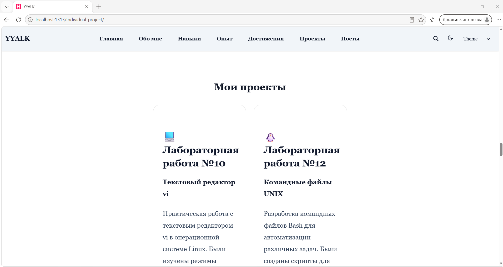
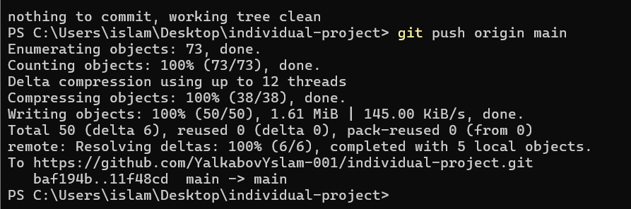

---

marp: true
theme: default
paginate: true
header: "Индивидуальный проект"
footer: "Ялкабов Ислам | НКАбд-06-25"
---

# Индивидуальный проект

## Этап 3

### Добавление достижений и профессиональной информации

**Студент:** Ялкабов Ислам
**Группа:** НКАбд-06-25

Российский университет дружбы народов
2026

---

# Цель этапа

Расширить персональный сайт профессиональной информацией.

### Основные задачи

* добавить Skills;
* добавить Experience;
* добавить Accomplishments;
* создать еженедельный пост;
* создать тематический материал;
* проверить работу сайта;
* сохранить изменения в Git.

---

# Используемые технологии

* **Hugo** — генерация сайта;
* **Markdown** — создание контента;
* **YAML** — настройка;
* **Git** — контроль версий;
* **GitHub** — хранение проекта;
* **GitHub Pages** — публикация;
* **Visual Studio Code** — редактирование.

---

# Раздел Skills

В профиль были добавлены основные навыки:

* C++;
* Python;
* Linux;
* Web Development;
* Git;
* GitHub;
* HTML;
* CSS;
* JavaScript;
* Markdown.

Раздел позволяет представить технологии, которые изучаются и используются в проектах.

---

# Skills — результат

Новые навыки были добавлены в структуру персонального сайта.

Проверено:

* название навыков;
* описание;
* отображение на странице;
* корректность оформления.



---

# Раздел Experience

В раздел **Experience** добавлена информация о практической деятельности.

Основные направления:

* разработка персонального сайта;
* работа с Hugo;
* Git и GitHub;
* создание Markdown-документации;
* разработка учебных программ;
* работа с Linux.


---

# Раздел Accomplishments

В раздел **Accomplishments** добавлены основные достижения и результаты.

### Примеры

* разработка персонального сайта;
* публикация на GitHub Pages;
* изучение Git и GitHub;
* создание Markdown-документации;
* выполнение учебных проектов;
* изучение Linux;
* разработка программ.


---

# Проверка сайта

После внесения изменений сайт был запущен локально:

```powershell
hugo server --disableFastRender
```

Адрес локального сайта:

```text
http://localhost:1313/
```

Была выполнена проверка новых разделов.


---

# Еженедельный пост

В рамках этапа создан третий еженедельный пост.

Пример структуры:

```text
content/
└── blog/
    └── week-3/
        └── index.md
```

В публикации описаны:

* выполненные задачи;
* изменения сайта;
* новые разделы;
* созданные материалы.


---

# Тематический материал

## Markdown, LaTeX и лёгкая разметка

В качестве тематической публикации рассмотрены технологии создания структурированных документов.

Основное внимание уделено:

* Markdown;
* LaTeX;
* форматированию текста;
* структуре документов;
* математическим формулам.




---

# Основы Markdown

Пример заголовков:

```markdown
# Заголовок
## Подзаголовок
### Раздел
```

Жирный текст:

```markdown
**жирный текст**
```

Курсив:

```markdown
*курсив*
```

Список:

```markdown
- первый пункт
- второй пункт
- третий пункт
```

---

# Таблицы и ссылки

### Таблица

```markdown
| Технология | Назначение |
|---|---|
| Hugo | Создание сайта |
| Git | Контроль версий |
| Markdown | Форматирование |
```

### Ссылка

```markdown
[GitHub](https://github.com)
```

Markdown позволяет создавать структурированные документы простым текстовым синтаксисом.

---

# Markdown и LaTeX

Markdown может использоваться совместно с LaTeX.

Например:

```text
$$
E = mc^2
$$
```

LaTeX используется для:

* математических формул;
* научных документов;
* отчётов;
* статей;
* библиографии.

---

# Тематическая статья на сайте

После подготовки Markdown-файла материал был добавлен в контент Hugo.

После генерации сайта статья стала доступна пользователям.


---

# Git

После завершения работы изменения были проверены:

```bash
git status
```

Добавлены в индекс:

```bash
git add .
```

Создан коммит:

```bash
git commit -m "Add skills experience accomplishments and posts"
```

---

# Отправка изменений

Для отправки обновлений в удалённый репозиторий использовалась команда:

```bash
git push
```

После выполнения команды изменения появились в GitHub.



---

# GitHub

В GitHub была проверена обновлённая версия проекта.
Проверено наличие:

* новых файлов;
* обновлённого профиля;
* новых публикаций;
* последних коммитов.


---

# Итоговый сайт

После выполнения третьего этапа сайт содержит:

* Biography;
* Interests;
* Education;
* Skills;
* Experience;
* Accomplishments;
* еженедельные публикации;
* тематические материалы.

---

# Результаты этапа

В результате:

✅ Добавлены профессиональные навыки.
✅ Добавлен опыт.
✅ Добавлены достижения.
✅ Создан еженедельный пост.
✅ Создан материал о Markdown и LaTeX.
✅ Выполнена локальная проверка.
✅ Изменения отправлены в GitHub.
✅ Обновлена опубликованная версия сайта.

---

# Вывод

Третий этап позволил расширить персональный сайт и превратить его в более полноценное портфолио.

Были добавлены профессиональные сведения, достижения и новые публикации.

Также были закреплены навыки работы с **Hugo, Markdown, Git и GitHub**.

---

# Спасибо за внимание!

## Этап 3 выполнен

**Ялкабов Ислам**
**НКАбд-06-25**
